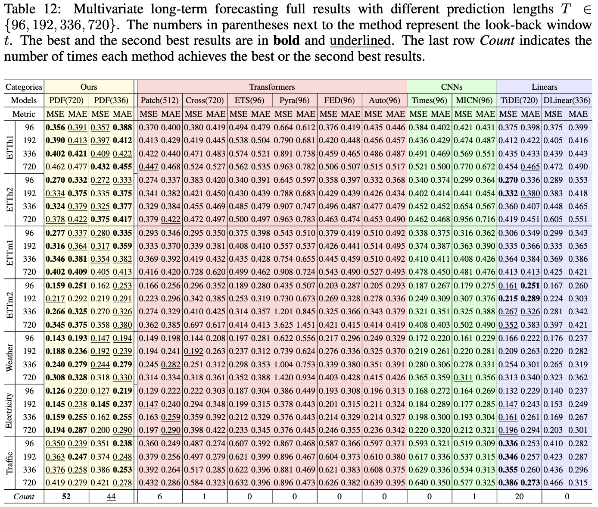

# Periodicity Decoupling Framework for Long-term Series Forecasting 🚀

<div align="left">
  
**[<a href="https://openreview.net/pdf?id=dp27P5HBBt">Paper Page</a>]**
**[<a href="https://zhuanlan.zhihu.com/p/699708089">知乎中文解读</a>]**
**[<a href="https://mp.weixin.qq.com/s/Zlz3EfP26r-50CuJtIgurw">时序人中文解读</a>]**

</div>


## 📰 News

- [2024-01-15] 🎉 Our paper has been accepted by ICLR 2024.

## 🌟 Results

Quantitatively, compared with Transformer-based models, PDF(720) yields an overall **14.59**% reduction in MSE and **10.77**% reduction in MAE. Compared with CNN-based models, PDF(720) yields an overall **24.61**% reduction in MSE and **19.91**% reduction in MAE. Compared with Linear-based models, PDF(720) yields an overall **7.05**% reduction in MSE and **5.51**% reduction in MAE.



## 🛠 Prerequisites

Ensure you are using Python 3.9 and install the necessary dependencies by running:

```
pip install -r requirements.txt
```

## 📊 Prepare Datastes

Begin by downloading the required datasets. All datasets are conveniently available at [Autoformer](https://drive.google.com/drive/folders/1ZOYpTUa82_jCcxIdTmyr0LXQfvaM9vIy). Create a separate folder named `./dataset` and neatly organize all the csv files as shown below:
```
dataset
└── electricity.csv
└── ETTh1.csv
└── ETTh2.csv
└── ETTm1.csv
└── ETTm2.csv
└── traffic.csv
└──  weather.csv
```

## 💻 Training

All scripts are located in `./scripts/PDF`. Choose from two historical input lengths: 336 and 720. For instance, to train a model using the ETTh2 dataset with an input length of 720, simply run:

```shell
sh ./scripts/PDF/720/ETTh2.sh
```

After training:

- Your trained model will be safely stored in `./checkpoints`.
- Visualization outputs are available in `./test_results`.
- Numerical results in .npy format can be found in `./results`.
- A comprehensive summary of quantitative metrics is accessible in `./results.txt`.

## 📚 Citation
If you find this repo useful, please consider citing our paper as follows:
```
@article{dai2024period,
  title={Periodicity Decoupling Framework for Long-term Series Forecasting},
  author={Dai, Tao and Wu, Beiliang and Liu, Peiyuan and Li, Naiqi and Bao, Jigang and Jiang, Yong and Xia, Shu-Tao},
  journal={International Conference on Learning Representations},
  year={2024}
}
```

## 🙏 Acknowledgement
Special thanks to the following repositories for their invaluable code and datasets:

- [https://github.com/thuml/Autoformer](https://github.com/thuml/Autoformer)
- [https://github.com/yuqinie98/PatchTST](https://github.com/yuqinie98/PatchTST)
- [https://github.com/Thinklab-SJTU/Crossformer](https://github.com/Thinklab-SJTU/Crossformer)
- [https://github.com/wanghq21/MICN](https://github.com/wanghq21/MICN)
- [https://github.com/thuml/Time-Series-Library](https://github.com/thuml/Time-Series-Library)
- [https://github.com/MAZiqing/FEDformer](https://github.com/MAZiqing/FEDformer)
- [https://github.com/zhouhaoyi/Informer2020](https://github.com/zhouhaoyi/Informer2020)

## 📩 Contact
If you have any questions, please contact [lpy23@mails.tsinghua.edu.cn](lpy23@mails.tsinghua.edu.cn) or submit an issue.
